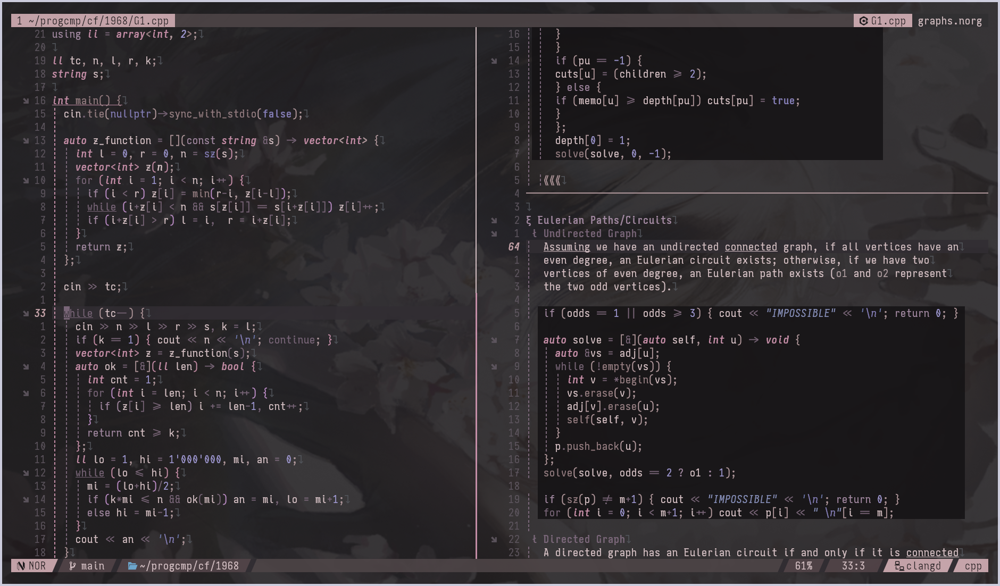
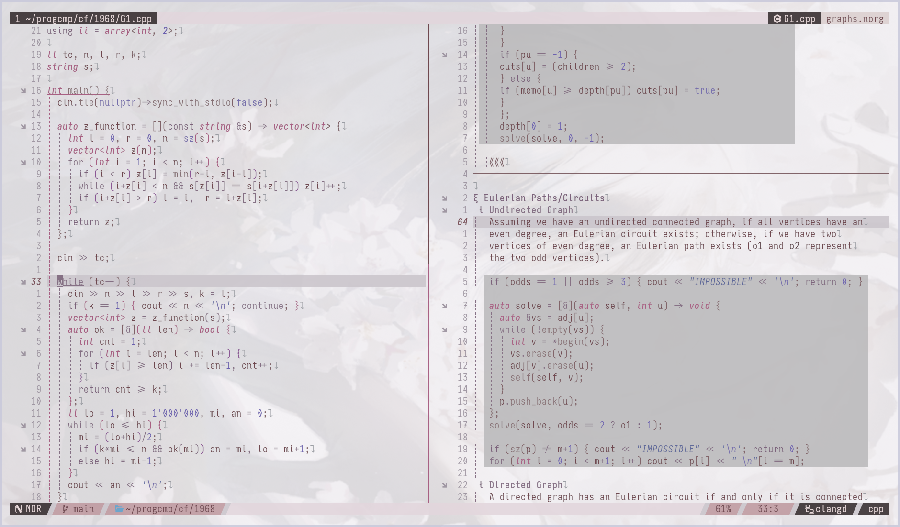

# Sakura 🌸

A low-contrast pink colorscheme for neovim inspired by [zenbones](https://github.com/mcchrish/zenbones.nvim),
[rose-pine](https://github.com/rose-pine/neovim), and [lackluster](https://github.com/slugbyte/lackluster.nvim),
built using [lush.nvim](https://github.com/rktjmp/lush.nvim).

# Previews

## Dark Theme


## Light Theme


# Installation

## [lazy.nvim](https://github.com/folke/lazy.nvim)

Plugin spec for [LazyVim](https://github.com/folke/lazy.nvim):

```lua
return {
    "anAcc22/sakura.nvim",
    dependencies = "rktjmp/lush.nvim",
    config = function()
        vim.opt.background = "dark" -- or "light"
        vim.cmd('colorscheme sakura') -- sets the colorscheme
    end
}
```

Plugin spec for [Nuwa.nvim](https://github.com/alyxshang/nuwa.nvim):

```lua
-- Installing the package.
nuwa.installPackage(
  "https://github.com",
  "rktjmp",
  "lush.nvim"
)

-- Installing the package.
nuwa.installPackage(
  "https://github.com",
  "anAcc22",
  "sakura.nvim"
)

-- Setting the background.
vim.opt.background = "dark" -- or "light"

-- Setting the colorscheme.
vim.cmd.colorscheme("sakura")
```
