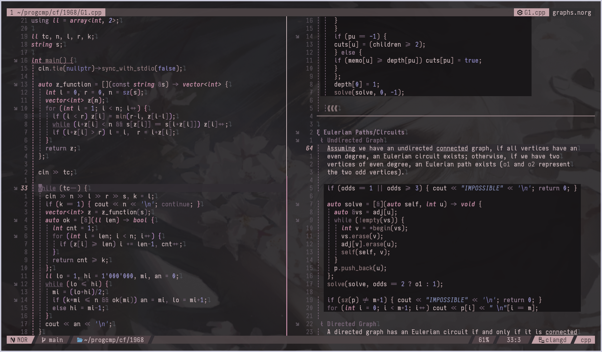
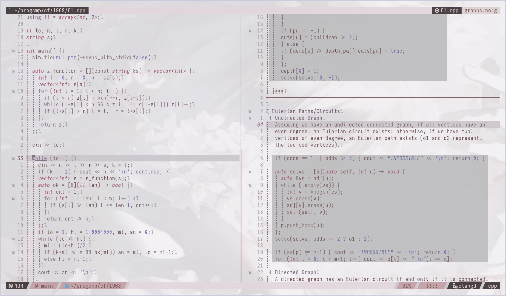

# Sakura 🌸

A low-contrast pink colorscheme for neovim inspired by [zenbones](https://github.com/mcchrish/zenbones.nvim),
[rose-pine](https://github.com/rose-pine/neovim), and [lackluster](https://github.com/slugbyte/lackluster.nvim),
built using [lush.nvim](https://github.com/rktjmp/lush.nvim).

# Previews

## Dark Theme


## Light Theme


# Installation

## [lazy.nvim](https://github.com/folke/lazy.nvim)

```lua
{
    "anAcc22/sakura.nvim"
}
```

# Usage

```lua
vim.opt.background = "dark" -- or "light"
vim.cmd.colorscheme("sakura");
```
